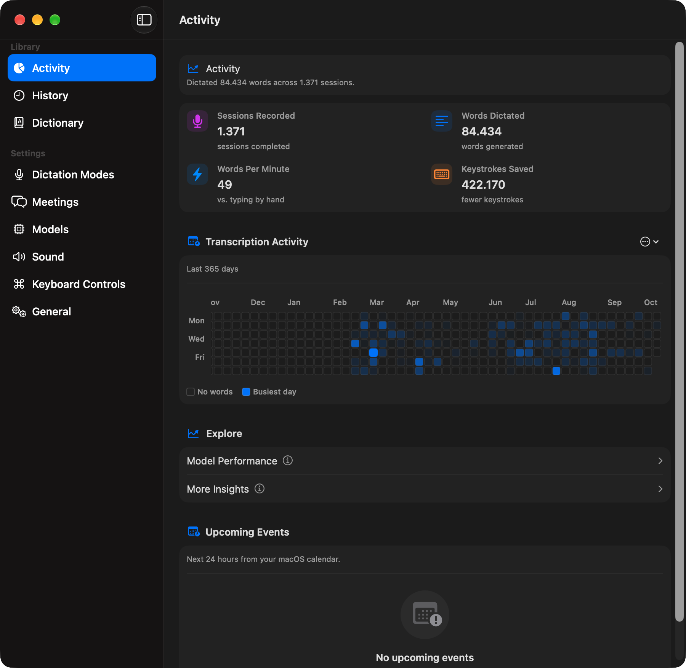
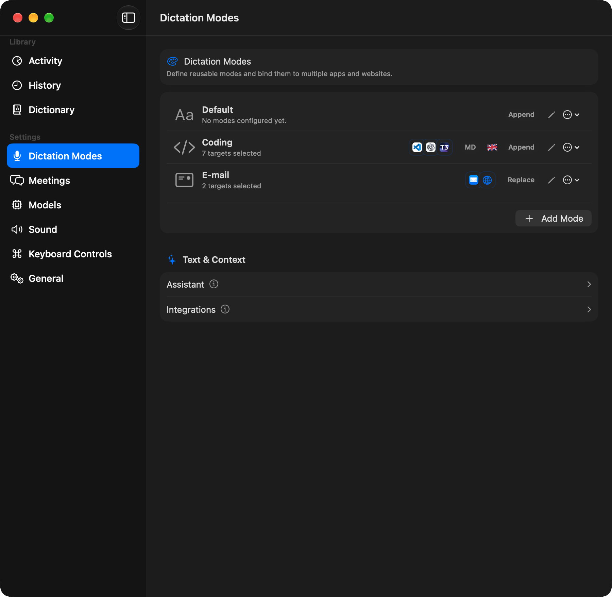
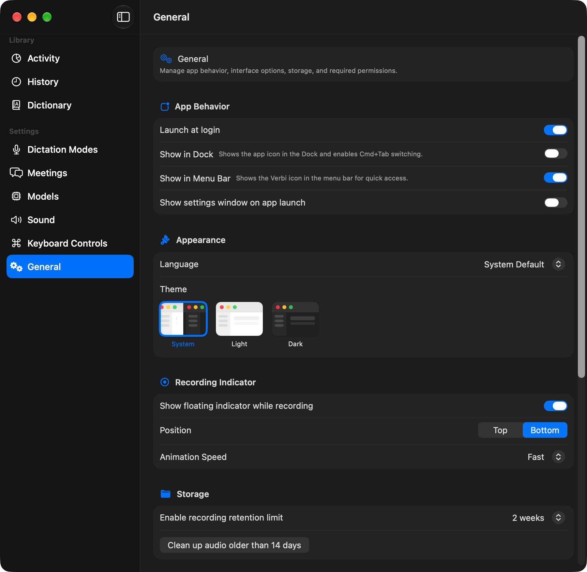

# Verbi for macOS

A native, local-first macOS app for dictation, meeting capture, and transcription. Turn speech into text, organize your transcription history, and generate meeting notes with optional AI services.

Verbi captures microphone and system audio and supports on-device transcription through the [FluidAudio SDK](https://github.com/FluidInference/FluidAudio). Recordings and transcription history stay on your Mac. Remote transcription and AI providers are optional; enabling them sends the content needed for those tasks to the configured provider.

## Key features

- **Meeting capture:** record microphone and system audio, with meeting detection for Google Meet, Microsoft Teams, Slack, and Zoom.
- **Dictation modes:** reuse modes across apps and websites, with configurable global shortcuts and text processing.
- **Transcription:** run on-device models on Apple silicon or configure a remote provider.
- **Meeting notes:** generate summaries, decisions, action items, and custom prompt outputs with optional AI post-processing.
- **History and activity:** browse local transcriptions, play recordings, export results, and track dictation activity.
- **File import:** transcribe existing MP3, M4A, and WAV recordings.
- **Personalization:** configure appearance, language, recording indicators, and audio retention.

## Screenshots

### Activity

Track recorded sessions, dictated words, keystrokes saved, and transcription activity over time.



### Dictation Modes

Create reusable dictation modes and assign them to apps and websites.



### General

Adjust launch behavior, appearance, recording indicators, and audio retention.



## Requirements

- macOS 15.0+ (Sequoia or later)
- Apple silicon Mac (arm64); Intel Macs are not supported

For building from source, see [Development](#development).

## Installation

### Homebrew

```bash
brew install --cask mourato/tap/verbi
```

Update with `brew upgrade --cask verbi`. The cask removes the Gatekeeper
quarantine attribute during installation. Releases
are signed with a stable certificate, so macOS privacy permissions survive
updates.

### First launch

Builds that are not notarized may be blocked by macOS Gatekeeper. If you
downloaded the app from a source you trust, either Control-click
`Verbi.app`, choose **Open**, and confirm, or remove the quarantine
attribute before opening it:

```bash
xattr -dr com.apple.quarantine "/Applications/Verbi.app"
```

This is expected for unsigned, ad-hoc, or self-signed builds. Notarization
requires membership in the paid Apple Developer Program; a free Apple ID is
not sufficient. After approving the app once, open it normally.

### Migrating from Vozinha / Prisma

Verbi replaces the previous display name (Vozinha) and technical identity
(`com.mourato.prisma`). Existing recordings and settings migrate automatically
on the first launch when the legacy Application Support folder is still present.

1. Install `Verbi.app` (DMG or the `Verbi-<version>.zip` release asset).
2. Open Verbi once and wait for the first-launch migration to finish.
3. Re-authorize microphone, screen recording, calendar, and browser automation
   if macOS prompts — TCC is per bundle ID and does not carry over.
4. If you used Launch at Login, turn it on again in Settings.
5. Quit and remove the old `Vozinha.app` (and any leftover Login Item for it).

An installed `com.mourato.prisma` build cannot be upgraded in place.
Treat Verbi as a fresh install with on-disk data migration.

## Documentation

- [Build and Test Reference](.agents/docs/build-and-test.md): commands, validation lanes, and focused checks.
- [Project workflow](docs/agents/project-workflow.md): module ownership, platform constraints, and privacy rules.
- [Agent instructions](AGENTS.md): repository guidance and specialist skill routing.
- [Known limitations](https://github.com/mourato/verbi/issues?q=is%3Aissue%20state%3Aopen%20label%3Aknown-limitation): tracked issues.

## Development

This project is CLI-first, with Xcode available for debugging and UI iteration.

Development requires Xcode 26.6 with Swift 6.2, selected Xcode command line tools (`xcode-select -p`), and Homebrew for setup. See the [toolchain baseline](.agents/docs/swift-6-2-agent-baseline.md) before changing Xcode or Swift versions.

```bash
git clone https://github.com/mourato/verbi.git
cd verbi
./scripts/setup-dev-environment.sh
make run
```

`./scripts/setup-dev-environment.sh` verifies the local developer toolchain, including `make`, installs Homebrew-managed tools (`swiftlint`, `swiftformat`), and configures tracked Git hooks (`core.hooksPath=scripts/hooks`). After `make` is available, `make setup` runs the same script. SwiftPM dependencies resolve automatically during build. Local AI model assets may download on first use.

The [Makefile](Makefile) is the command source of truth. Run `make help` for the full target list and consult the [Build and Test Reference](.agents/docs/build-and-test.md) for suite selection and validation details.

| Purpose | Command |
|---------|---------|
| Build Debug / Release | `make build` / `make build-release` |
| Build and open the app | `make run` / `make run-release` |
| Run fast / broad SwiftPM tests | `make test` / `make test-full` |
| Run Xcode parity tests | `make test-parity` |
| Check changed scope | `make scope-check` |
| Select the automatic validation lane | `make validate ARGS="--lane auto"` |
| Check Swift style / architecture | `make lint` / `make arch-check` |
| Rebuild the meeting notes editor | `make build-meeting-notes-editor` |
| Package a local DMG | `make dmg` |
| Build / preview API documentation | `make docs` / `make docs-preview` |

Prefix supported commands with `AGENT=1` for compact output. Before pushing or preparing a release, run `make validate ARGS="--lane auto"` and any additional gates required by the changed surface. Full validation runs strict lint followed by `make build-test`.

The meeting notes editor bundle is committed as an app resource; app builds do not run npm. After changing `Editor/`, run `make build-meeting-notes-editor` before building or testing the app.

Use `make xcodebuild-safe` for direct Xcode build workflows so the repository's wrapper supplies the required flags.

### Architecture

The package uses a modular split and an aggregation target:

- `MeetingAssistantCoreCommon` (shared utilities/resources)
- `MeetingAssistantCoreDomain` (entities/protocols/use cases)
- `MeetingAssistantCoreInfrastructure` (integration services)
- `MeetingAssistantCoreData` (persistence repositories)
- `MeetingAssistantCoreAudio` (capture/buffering/worker pipeline)
- `MeetingAssistantCoreAI` (transcription/post-processing/rendering)
- `MeetingAssistantCoreUI` (view models/coordinators/views)
- `MeetingAssistantCore` (compatibility export layer)

Physical source directories under `Packages/MeetingAssistantCore/Sources/` use the short names `Common`, `Domain`, `Infrastructure`, `Data`, `Audio`, `AI`, `UI`, `Core`, `Mocking`, and `MockingMacros`.

Guideline: import only required modules in each file, and expose cross-module APIs intentionally through access control and domain protocols.

### Contribution workflow

Follow [AGENTS.md](AGENTS.md) for branch, worktree, validation, and delivery requirements. Keep changes focused and preserve unrelated work. Documentation and code comments are maintained in English; user-facing app strings use localization keys.

## Permissions

Grant permissions as needed in **System Settings → Privacy & Security**:

| Permission | Why it is needed |
|-----------|------------------|
| Screen Recording | System audio capture via ScreenCaptureKit |
| Microphone | Dictation and microphone audio in meetings |
| Accessibility | Global shortcuts and Assistant actions |
| Calendar | Upcoming meeting events and reminders |
| Automation | Supported browser integrations; macOS prompts for the target browser |

## Local builds and signing

For local installs, `make dmg` supports automatic, certificate-based, and ad-hoc signing. Use a stable signing identity to help preserve macOS privacy permissions across updates. The public release workflow below uses a separate configured certificate; notarized distribution requires Developer ID signing.

```bash
# 1) Build DMG for manual installs
# Interactive mode: detects Apple Development automatically and offers ad-hoc as an alternative
make dmg

# Force Apple Development mode without prompting; fails fast if the identity is missing
MA_RELEASE_SIGNING_MODE=identity make dmg

# Force unsigned/ad-hoc mode without prompting
MA_RELEASE_SIGNING_MODE=adhoc make dmg

```

Notes:

- Keep `CFBundleIdentifier` unchanged between ordinary version bumps. The Verbi
  cutover intentionally changes it once from `com.mourato.prisma` to
  `com.mourato.verbi` (see Migrating from Vozinha / Prisma above).
- Keep `MA_RELEASE_CODE_SIGN_IDENTITY` stable if you customize the identity name.
- `make dmg` builds the Release app, packages it, signs the DMG, and writes `dist/Verbi.dmg`.
- `make dmg` now prompts for signing mode. The default choice is automatic detection: if the configured Apple Development identity is found in the Keychain, the DMG uses it; otherwise it falls back to unsigned/ad-hoc.
- Use `MA_RELEASE_SIGNING_MODE=adhoc make dmg` or `MA_RELEASE_SIGNING_MODE=identity make dmg` to skip the prompt and force a specific mode.
- Install by replacing the existing app in `/Applications` to maximize permission persistence.

### GitHub releases from commit history

Prerequisites: macOS/Xcode, Python 3.9+, GitHub CLI (`gh auth login`), and a
current Codex CLI (`codex login`) supporting `exec --ephemeral --ignore-user-config`.
No PRs, CI setup, or separate API key are required. Codex uses its configured
authentication with the default model. Commit messages, bodies and changed-file
names are sent to Codex for summarization; source contents are not sent.
Sessions are ephemeral, shell and web search are disabled, personal integrations
are not loaded, prompts/intermediate summaries are not written to files, and only
the final release notes are saved. Offline fixtures (`make release-test`) exercise
Git/CLI boundaries and a tiny native DMG using macOS `hdiutil` and `codesign`;
they do not build the app, mount images, or open Finder.

Start from a clean, committed checkout. Bump the app version separately with
`scripts/bump-version.sh --version 1.2.3 --build 123` and commit it when needed.
`VERSION` defaults to `App/Info.plist`; an explicit version must match that file.

```bash
# Prepare locally: build once, sign, create ZIP, headless DMG and cask, generate notes.
make release-prepare VERSION=v1.2.3

# Review/edit dist/releases/v1.2.3/release-notes.md in your editor.
# Commit must already exist on GitHub; push separately before publication if needed.
make release-publish VERSION=v1.2.3

# Preview notes without building or publishing; override the previous release if needed.
make release-notes FROM=v1.2.2
# First release, explicitly include the entire history:
make release-prepare VERSION=v1.2.3 FROM=ROOT
```

By default, the baseline is the latest published stable GitHub release. Fetch
its tag locally with `git fetch origin --tags` if missing. `FROM` can name any
ancestor commit/tag; `ROOT` explicitly selects all history. Notes consider every
commit in the range, including merged branches, merge messages and reverts.
Large histories are summarized in batches and then consolidated in English.
AI notes remain a draft to review: vague commit messages limit what can be inferred.

Preparation writes `dist/releases/<tag>/Verbi-<version>.dmg`,
`Verbi-<version>.zip`, editable `release-notes.md`, the Homebrew cask `verbi.rb`,
and `release.json` containing
the source commit and asset SHA-256 checksums. The app and dSYM remain in `dist/`.
An existing prepared directory is never overwritten; move it aside deliberately
before rebuilding. Release commands serialize shared packaging within one checkout.

Publication checks the clean checkout, version, source commit, repository and
asset checksums. It targets `origin` on github.com, atomically creates the tag at
the exact prepared commit, uploads both assets to a draft, then publishes it. It never
pushes branches or replaces existing tags/assets. A failed upload or final
publication can leave a GitHub draft; inspect it before retrying. To recover,
finish that draft manually with the prepared assets/notes, or delete that draft
deliberately before retrying; if a tag exists, handle it separately. Do not
rebuild or overwrite assets silently.

Releases are signed with the stable self-signed identity
`Prisma Local Code Signing` (override with `MA_RELEASE_CODE_SIGN_IDENTITY`) and
are not notarized. Preparation fails if the built app lacks a certificate-based
designated requirement. macOS ties privacy permissions to that requirement:
keep the same certificate (back up its `.p12` with the private key) so grants
survive updates. A new or lost certificate resets permissions for every user.

### Homebrew tap

The cask lives in [`mourato/homebrew-tap`](https://github.com/mourato/homebrew-tap)
as `Casks/verbi.rb`. `make release-publish` updates it through the GitHub API
after the release is public. If the tap repository does not exist, publication
prints a notice and skips it. If the update fails, the release stays published
and the command exits with an error; copy `dist/releases/<tag>/verbi.rb` to the
tap manually.

Check a cask change locally with `brew style mourato/tap/verbi` and
`brew audit --cask --online mourato/tap/verbi`.

`App/MeetingAssistant.entitlements` is intentionally empty.

## Troubleshooting

### The model takes a long time to load

On first use, FluidAudio may download and prepare the model(s). This can take a few minutes depending on your network.

### Audio capture does not work

- Check **Privacy & Security → Screen Recording** and ensure Verbi is enabled.
- If you rebuilt/reinstalled the app, macOS may require re-granting permission.

## License

[MIT](LICENSE)
